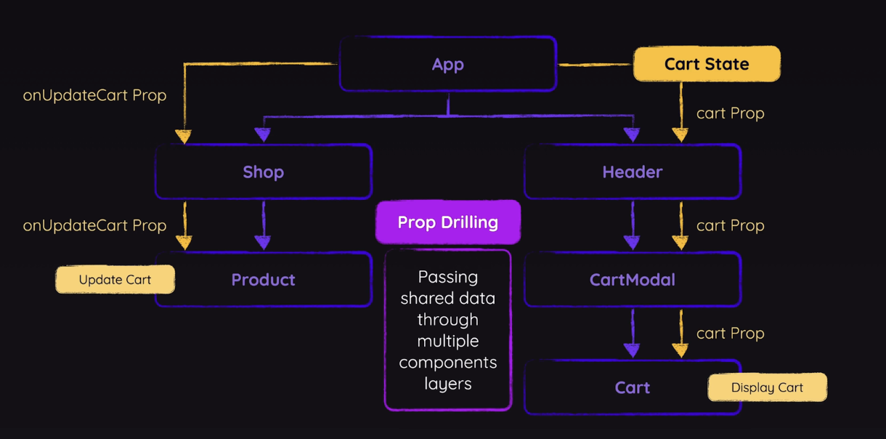
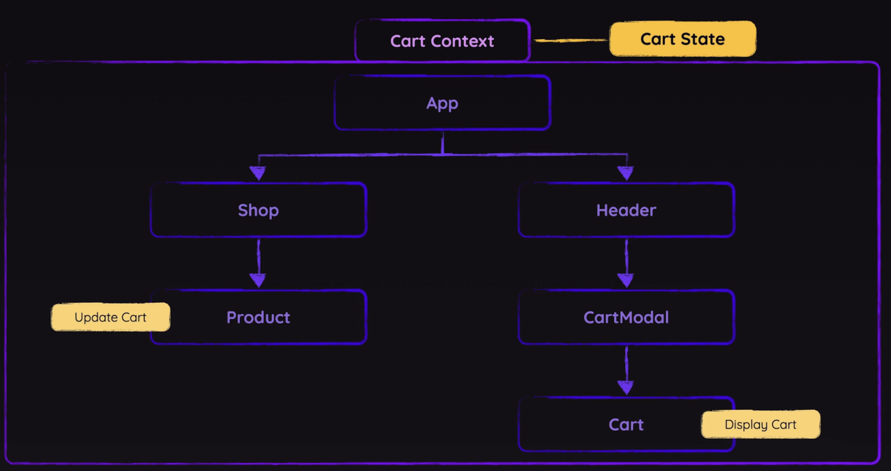
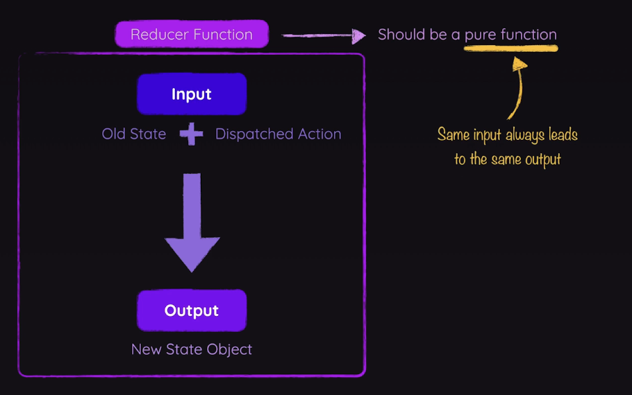

In basic apps, we solved state management problems by "Lifting Up State", which means when two sibling or cousin components need the same value, you lift up the state to the common ancestor and pass it down as props.

At scale, this can become an issue because:
- **Too many layers**: When you lift state high up, you often have to pass it through components that don’t need it, just so their grandchildren can use it. That makes your code hard to follow.
- **Tightly linked components**: Changing that shared state means updating every component in the chain. A small tweak in one place forces you to touch a lot of files.
- **Extra re-renders**: If a parent holds state, every child below it re-renders on change—even those that don’t care. In a big app, that slows things down.
- **Global needs**: Things like “is user logged in?” or “what’s the theme?” are needed everywhere. It’s awkward to lift those up to a single parent without dragging them through the entire tree.

More formally, the this issue of passing data through many layers of components is called **Prop Drilling**.


In the left subtree, we have to 'drill' down the `onupdateCart` prop with a bunch of prop forwarding, and in the right subtree for the `cart` prop. Although only the child component needs the prop, we pass it down through parent components that don't need the prop and it starts to messy up the code.

A look into prop drilling on the left subtree:

`Shop.jsx:`
```jsx
export default function Shop({ onAddItemToCart }) {  
  return (  
    <section id="shop">  
      <h2>Elegant Clothing For Everyone</h2>  
      <ul id="products">  
        {DUMMY_PRODUCTS.map((product) => (  
          <li key={product.id}>  
            <Product {...product} onAddToCart={onAddItemToCart} />  
          </li>        
        ))}  
      </ul>  
    </section>  
  );  
}
```

`Product.jsx:`
```jsx
export default function Product({  
  id,  
  image,  
  title,  
  price,  
  description,  
  onAddToCart,  
}) {  
  return (  
    <article className="product">  
        
      <div className="product-content">  
        <div>          
          <h3>{title}</h3>  
          <p className='product-price'>${price}</p>  
          <p>{description}</p>  
        </div>        
          <p className='product-actions'>  
          <button onClick={() => onAddToCart(id)}>Add to Cart</button>  
        </p>      
        </div>    
	</article>  
  );  
}
```

`App.jsx (condensed):`
```jsx

// These are being drilled down all the way to the root of the tree
function handleAddItemToCart(id) {...}
function handleUpdateCartItemQuantity(productId, amount) {...}

return (  
  <>  
    <Header cart={shoppingCart}  
      onUpdateCartItemQuantity={handleUpdateCartItemQuantity}  
    />  
    <Shop onAddItemToCart={handleAddItemToCart} />  
  </>);
```

Notice how we had to pass `handleAddItemToCart` unnecessarily through `Shop`, just to get it to `Product`. At scale you can see how this can start to become an issue.

**Component Composition**

One solution to this (that is not the context API, we'll get there) is component composition. In other words, we can let `App` pass `Product` (with its onAddItemToCart prop) directly into `Shop` as a child component, so Shop doesn’t have to forward that prop through itself but can instead provide it directly to `Shop`. This looks like:

`App.jsx Snippet:`
```jsx
// These are being drilled down all the way to the root of the tree
function handleAddItemToCart(id) {...}
function handleUpdateCartItemQuantity(productId, amount) {...}

return (  
  <>  
    <Header cart={shoppingCart}  
      onUpdateCartItemQuantity={handleUpdateCartItemQuantity}  
    />  
    <Shop>      
    {DUMMY_PRODUCTS.map((product) => (  
          <li key={product.id}>  
            <Product {...product} onAddToCart={handleAddItemToCart} />  
          </li>      
	  ))}  
    </Shop>  
  </>
);
```

`Shop.jsx:`
```jsx
export default function Shop({ children }) {  
  return ( // Need to include the 'children' prop for component composition
    <section id="shop">  
      <h2>Elegant Clothing For Everyone</h2>  
      <ul id="products">{children}</ul>  
    </section>  
  );  
}
```

In this way, we were able to get rid of 1 layer of prop forwarding in our tree. This works great for getting rid of one or two layers, but imagine a huge component tree; this solution gets messy when trying to fix the larger problem because then everything would end up as wrapper components in `App` which can get bloated.

**Introduction to the Context API**

The context API gives us an easy way to share state across component layers with **context**, which wraps a subsection of your entire component tree. In our shop example, we'll wrap the whole tree for globally share state, but understand that this could be inefficient at scale and its typically a chunk of the tree with shared context managed at once.



By convention, we like to but our state storage files in a new folder called `store`. Within that `store` folder for our current shopping project, we can create a file `shopping-cart-context.jsx` to hold the context of our app's state.

So let's create some context and focus in on providing that context to the right component subtree, whose child component is `Cart`. 


`shopping-cart-context.jsx:`
```jsx
import { createContext } from 'react'; // context api 

export const CartContext = createContext({ 
  items: []
});

// Like useState, the initial value we pass into createContext is the default value
```

When thinking about context, we need to think about which components will be reading and writing to that context. This is because the `CartContext` is itself a component, and we will want to *wrap* that component around the ancestor lineage of the components that need to read/write to its properties. In the case of our app, `Product` will write the context's `items` property when it calls `handleAddItemToCart`, and `Cart` will need to read from that and render it. `Cart` will also need to write to `CartContext` too, as in the old setup its drilling down the function `handleUpdateCartItemQuantity` all the way from `App`, several layers above it.

One last important thing; the default value you pass to `createContext(defaultValue)` only applies when you don’t wrap a matching provider in the ancestor tree of your consumer, otherwise it’s ignored and treated as a fallback only. Once you render the context component, React expects a `value` prop. If you omit it, any `useContext(ContextComponent)` call returns `undefined` instead of your default value, which is not what we want. Thus we need to explicitly pass `value={shoppingCart}` as a property, avoiding undefined errors and giving our linking our context to the state to be read from.

`App.jsx Snippet:`
```jsx
function handleAddItemToCart(id) {...}
function handleUpdateCartItemQuantity(productId, amount) {...}

const [shoppingCart, setShoppingCart] = useState({
  items: [];
});

return (  
  <CartContext.Provider value={shoppingCart}>
    <Header cart={shoppingCart}  
      onUpdateCartItemQuantity={handleUpdateCartItemQuantity}  
    />  
    <Shop>      
    {DUMMY_PRODUCTS.map((product) => (  
          <li key={product.id}>  
            <Product {...product} onAddToCart={handleAddItemToCart} />  
          </li>      
	  ))}  
    </Shop>  
  </CartContext.Provider>
);
```

> Note: In this example, we’re using the traditional approach compatible with React versions prior to 19, where we wrap our components with `<CartContext.Provider>` and pass a value prop. Starting with React 19, you can simplify this by rendering `<CartContext>` directly as a provider, eliminating the need for the `.Provider` component property. This new syntax reduces boilerplate and streamlines context usage in newer React versions.

**Consuming Context**

To consume your Context object, in addition to of course importing the object itself, there is a new hook you'll need too, `useContext`. Its very simple to use, all you have to do is pass your context object into `useContext`, and you'll get a new object ready to use as context locally. This would look like

`const cartContext = useContext(CartContext)`

> Note: As an alternative, in React 19+ as a newer feature, you could use a different hook, just called `use` to accomplish the same thing. The difference: the `use` hook is a lot more flexible, being able to be used in blocks (`if`, `for`, etc.), where typical React Hooks CANNOT do this, as we recall they must be at the top of the component function on their own. There is much more nuance to the `use` hook, but don't worry about that right now.

So now, inside of `Cart` and its parents, we can remove the  `items` prop that we defined in `CartContext`, and simply call `cartContext.items` to consume the contexts properties:

`Cart.jsx:`
```jsx
import { useContext } from 'react';
import { CartContext } from '../store/shopping-cart-context.jsx';

export default function Cart({ onUpdateItemQuantity }) {  
  const { items } = useContext(CartContext)
  
  const totalPrice = items.reduce(  
    (acc, item) => acc + item.price * item.quantity,  
    0  
  );  
  const formattedTotalPrice = `$${totalPrice.toFixed(2)}`;  
  
  return (  
    <div id="cart">  
      {items.length === 0 && <p>No items in cart!</p>}  
      {items.length > 0 && (  
        <ul id="cart-items">  
          {items.map((item) => {  
            const formattedPrice = `$${item.price.toFixed(2)}`;  
            return (  
              <li key={item.id}>  
                <div>  
                  <span>{item.name}</span>  
                  <span> ({formattedPrice})</span>  
                </div>  
                <div className="cart-item-actions">  
                  <button onClick={() => onUpdateItemQuantity(item.id, -1)}>  
                    -  
                  </button>  
                  <span>{item.quantity}</span>  
                  <button onClick={() => onUpdateItemQuantity(item.id, 1)}>  
                    +  
                  </button>  
                </div>  
              </li>  
            );  
          })}  
        </ul>  
      )}  
      <p id="cart-total-price">  
        Cart Total: <strong>{formattedTotalPrice}</strong>  
      </p>  
    </div>  
  );  
}
```

In older React versions (<16.8, before hooks were introduced), there's an alternative syntax using `<Context.Consumer>` instead of `useContext` you might see for reading from context. This might help understand a bit what's going on under the hood, but is not recommended in modern react as it adds extra complexity. This would look something like:

```jsx
// Older React (before Hooks)
<MyContext.Consumer>
  {/* MyContext.Consumer automatically provides the context which we then have destructured for ease of use*/}
  {({ handler1, handler2 }) => (
    <>
      {/* ...rest of the JSX here which uses the handlers */}
    </>
  )}
</MyContext.Consumer>
```


**Providing Context**

The context API's awesomeness is that we don't need to manually write our state to context. We just need to properly provide the context to the API, and it will know when to re-render our components so that they get the correct read access to the updated state

We already have `<CartContext.Provider value={shoppingCart}>`, allowing us to read state from context, but we are writing to state through handler functions `handleAddItemToCart`, and `handleUpdateCartItemQuantity`, that we pass down the component chain through props, not context. To solve this, we simply add those handler functions to an object the read value(s) from our context, and then pass that object into the context provider.

``
`App.jsx (condensed):`
```jsx
function handleAddItemToCart(id) {...}
function handleUpdateCartItemQuantity(productId, amount) {...}

const [shoppingCart, setShoppingCart] = useState({
  items: [];
});

const contextValue = {
  items: shoppingCart.items,
  addItemToCart: handleAddItemToCart,
  updateCartItemQuantity: handleUpdateCartItemQuantity
}

return (
  // Pass in state writing handlers via contextValue, not just state itself
  <CartContext.Provider value={contextValue}>
    <Header cart={shoppingCart}  
      onUpdateCartItemQuantity={handleUpdateCartItemQuantity}  
    />  
    <Shop>      
    {DUMMY_PRODUCTS.map((product) => (  
          <li key={product.id}>  
            <Product {...product} onAddToCart={handleAddItemToCart} />  
          </li>      
	  ))}  
    </Shop>  
  </CartContext.Provider>
);

```

One extra tip: for IDE autocompletion purposes, and for code readability, we should add dummy functions as the default value for these new state writing handlers as context properties.

`shopping-cart-context.jsx:`
```jsx
import { createContext } from 'react'; // context api 

export const CartContext = createContext({ 
  items: [],
  addItemToCart: () => {},
  updateCartItemQuantity: () => {}
});

// Don't worry about matching dummy function signatures to the actual signature the context will hold
```


**Outsourcing Context & State**

> At this point, we are ready to fully migrate to the context API. I'm not going to write this all out, but that would mean removing all of the props in `CartContext` (`items`, `addItemToCart`, `updateCartItemQuantity`) fully from the current prop drilling design, and using the context API everywhere that we can reasonably do so.

One new key design change we can make though, is fully outsourcing the implementation of all the state and state updating handlers inside the context provider within `shopping-cart-context.jsx`, in our own custom context provider we can call `CartContextProvider` (NOT `CartContext.Provider` that is automatically provided by the context API).

`shopping-cart-context.jsx (condensed):`
```jsx
import { createContext, useState } from 'react'; // context api 
// import handler dependencies

// Notice: All but the context object is inside the provider component
export const CartContext = createContext({ 
  items: [],
  addItemToCart: () => {},
  updateCartItemQuantity: () => {}
});

// For managing context data and providing that data to the application
export default function CartContextProvider({ children }) {
  function handleAddItemToCart(id) {...}
  function handleUpdateCartItemQuantity(productId, amount) {...}

  const [shoppingCart, setShoppingCart] = useState({
   items: [];
  });

  const contextValue = {
    items: shoppingCart.items,
    addItemToCart: handleAddItemToCart,
    updateCartItemQuantity: handleUpdateCartItemQuantity
  }
  
  return (
    <CartContext.Provider value = {contextValue}>
      {children} {/*Don't forget to provide the children prop*/}
    </CartContext.Provider>
  );
}
```

Now we have much better separation of concerns. At this point, notice how lean and clean our `App` component has become:

`App.jsx ()` 
```jsx
import CartContextProvider from './store/shopping-cart-context.jsx';
// ... other imports

function App() {
  return (
    <CartContextProvider>
      <Header />
      <Shop>
        {DUMMY_PRODUCTS.map((product) => (
          <li key={product.id}>
            <Product {...product} />
          </li>
        ))}
      </Shop>
    </CartContextProvider>
  );
}
```

**The useReducer hook**

The `useReducer` hook is a great tool to reduce design complexity when state updating depends on the previous state, which is very common. In react, you can think of this as executing something along the lines of `(prevState, action) => nextState`.

The hook looks similar to useState, instead with the signature: `const [state, dispatch] = useReducer(reducer, initialState)`. The **dispatch** function simply just a function that runs an action. An **action** is just the object you pass to dispatch that tells your reducer what happened and what data it needs. Key point of confusion: the action is NOT the logic to run, it's simply the data/metadata object forwarded to the reducer to describe what the reducer should run. Typically an action has two properties: `type`, a  string that acts as an identifier for the reducer to reference, and `payload`, some extra data your reducer uses when running the action after it has identified which action to run (may not be needed though). Typically you'd have a number of different actions, and run `if` checks or a `switch` block for control flow on how the reducer should update the state. The purpose of this is to centralize all the ways the state can update into a single `stateReducer`, rather than having the state updating logic spreading across a whole bunch of `setState` calls.

The reducer function itself is just a typical JS reducer function, with the architecture that slots in with the Context API as previously described with action dispatching. Like the default `[...].reduce` implementation, custom reducers should be a *pure functions*. In other words, the same input should always lead to the same output, which is why you need a new state object so it doesn't depend on the current state for reads or writes. This principle also means things like sending network requests violate purity too.



In our app, we can implement `useReducer`:

`shopping-cart-context.jsx (condensed):`
```jsx
import { createContext, useReducer } from 'react';

export const CartContext = createContext({ 
  items: [],
  addItemToCart: () => {},
  updateCartItemQuantity: () => {}
});

// Handler logic refactored into the reducer
// When we have lots of reducers, we may move them to their own file(s)
function shoppingCartReducer(state, action) {
  if (action.type === 'ADD_ITEM') {
    // add item impl
    // Note: just like in useState, make sure you maintain purity (i.e. make new objects, don't mutate the old state)
  }
  else if (action.type === 'UPDATE_ITEM_QUANTITY') {
    // update item quantity impl
  }  
  
  return state;
}

export default function CartContextProvider({ children }) {
  
  const [shoppingCart, shoppingCartDispatch] = useReducer(
    shoppingCartReducer, {items: []}
  );

  // Significantly simplified handlers
  function handleAddItemToCart(id) {
    shoppingCartDispatch({
      type: 'ADD_ITEM',
      payload: id
    })	
  }
  function handleUpdateCartItemQuantity(productId, amount) {
    shoppingCartDispatch({
      type: 'UPDATE_ITEM_QUANTITY',
      payload: {productId, amount}
    })	
  }

  const contextValue = {
    items: shoppingCart.items,
    addItemToCart: handleAddItemToCart,
    updateCartItemQuantity: handleUpdateCartItemQuantity
  }
  
  return (
    <CartContext.Provider value = {contextValue}>
      {children} {/*Don't forget to provide the children prop*/}
    </CartContext.Provider>
  );
}
```

> Note: Just like using an arrow function inside your `setState` , you are guaranteed to get the latest updated state from `state` using this design pattern, which recall you don't get due to asynchronous state update batching when state updating without the arrow function from previous state.

Why is this all useful? Well, when your state includes several (3-5 ish to start to see value) related values that must update in response to the same event using separate `useState` calls can let them drift out of sync. By switching to `useReducer`, you group those dependent updates into a single atomic action so every piece of state changes together reliably. The gain you get is from abstracting manual state updates into actions that can group different combos of state updates.
