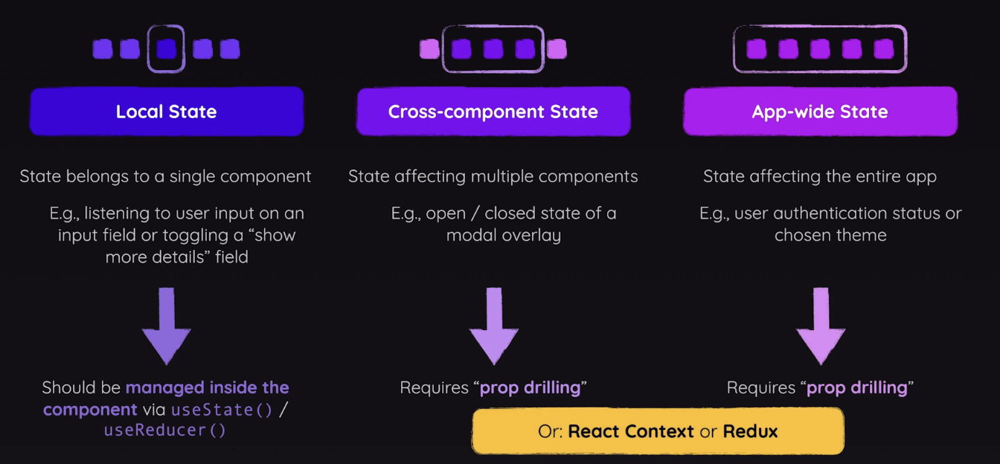
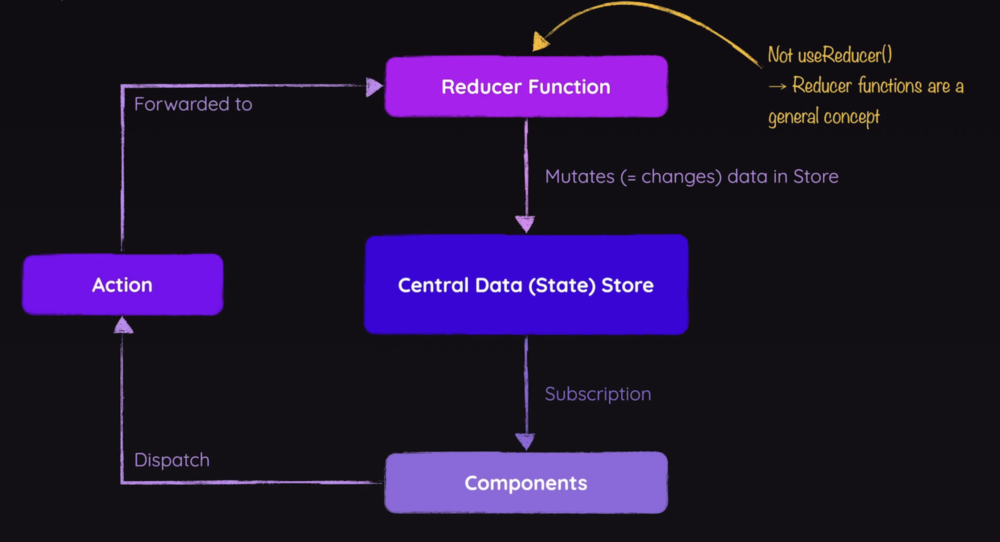

> Important: Before reading this, the [React Context API](./react-context-api) is direct prerequisite knowledge.

**The What and Why of Redux**

**Redux** is one of the most popular 3rd party libraries on the market used with React, used for both cross-component and app-wide state management. Although, you can use Redux independently from React, and there are even implementations in other JS and non JS frameworks/languages. 

At a high level, Redux solves the same problem as the context API, but in a different way that often works better at very large scales. Choosing Redux or Context is NOT a mutually exclusive decision, you can totally use both, and that typically might look like choosing Redux for app-wide and Context for select multi-component pockets of state.



There are some disadvantages to the context API we should be aware of. Note that the are not universal, but depend on what the application looks like. So Redux is a good choice when these disadvantages become present and persistent (or you eventually have the intuition to know they will occur ahead of time). 

One key disadvantage is increasingly complex setup and management at scale for large-enterprise level apps. This might look something like an increasingly annoying nesting of context providers:

```jsx
return (
  <AuthContextProvider>
    <ThemeContextProvider>
      <UIInteractionContextProvider>
        <MultiStepFormContextProvider>
          <UserRegistration />
        </MultiStepFormContextProvider>
      </UIInteractionContextProvider>
    </ThemeContextProvider>
  </AuthContextProvider>
);
```

The natural solution would be trying to consolidate all the context providers in one file, but then that will get bloated as you scale.

```jsx
import React, { createContext, useState } from 'react';

export const AllContext = createContext();

export function AllContextProvider({ children }) {

  const [isAuth, setIsAuth] = useState(false);
  const [isEvaluatingAuth, setIsEvaluatingAuth] = useState(false);
  const [activeTheme, setActiveTheme] = useState('default');
  const [someValue, setSomeValue] = useState(/* initial */);
  // ... more state

  function loginHandler(email, password) {...}
  function signupHandler(email, password) {...}
  function changeThemeHandler(newTheme) {...}
  // ... more handlers

  const contextValue = {
    isAuth,
    setIsAuth,
    isEvaluatingAuth,
    setIsEvaluatingAuth,
    activeTheme,
    setActiveTheme,
    loginHandler,
    signupHandler,
    changeThemeHandler,
    // ... more context
  };

  return (
    <AllContext.Provider value={contextValue}>
      {children}
    </AllContext.Provider>
  );
}
```

Another key disadvantage at scale is performance issues. Without getting into to much detail, the Context API was designed and is optimized for low frequency, unlikely updates (think theme, auth, etc.), and its not that great for more high frequency changes. 

**How Redux Works**

Redux is all about having *one single* central data/state store for the entire application, and it is well optimized for this at lower levels for latency, and at higher levels for design. At a high level, we *subscribe* components to the data store, and whenever the data changes, the store *notifies* the component with a **slice** of the redux store to use as a state update. COMPONENTS WILL NEVER DIRECTLY MANIPULATE STORE DATA, instead dispatch actions that run in reducer functions to mutate the data. Notice in the diagram the one way data flow, instead of two way, this is a fundamental part of Redux's design that simplifies state management.



> IMPORTANT: a Redux data store will be created with help of a function called `createStore()`. When using that function in your code, you might get a **deprecation warning** by your IDE or when running the app; the deprecation came with Redux 4.2.0 in 2022. **You should ignore this warning!** You can still use `createStore()` without issues and will see it often in React codebases. The React Redux team now recommends the usage of an extra package called **Redux Toolkit** and another way of creating the Redux store. Understanding `createStore` is nonetheless some crucial knowledge that's required no matter if you're then using Redux Toolkit or not!

**Core Redux Concepts**

Redux provides a single state container you create by calling `createStore(reducer)`. This central function is like a warehouse for your app’s data: you hand it a reducer and it gives you back a store. That store exposes three key methods: `dispatch(action)` to send updates which works just like with the ContextAPI, `getState()` to read the current snapshot, and `subscribe(subscriber)` to watch for changes, which is automatically run whenever the data in the stored has changed. 

Here is a basic demonstration in a Node.JS app, so look into how Redux works on a basic level without even talking about React or components:

`redux-demo.js`
```js
const redux = require('redux');  
  
// This reducer adds 1 to whatever the current counter is  
const counterReducer = (state = { counter: 0 }, action) => {  
	return {  
		counter: state.counter + 1  
	};  
};  
  
// When state changes, this is what notified subscribers will run 
// In React, this will means subscribing components
const counterSubscriber = () => {  
    console.log(store.getState()); 
};  
  
// On createStore Redux dispatches an internal INIT action: counter 0 -> 1.  
const store = redux.createStore(counterReducer);  
store.subscribe(counterSubscriber);  
  
// Reducer runs again: counter 1 -> 2, then subscriber logs it.  
store.dispatch({ type: 'INCREMENT' });
```

As commented above `createStore`, it is noted that an internal `INIT` action is called when `createStore` is called. If we implement some control flow into our reducer (even though for now our only action is `INCREMENT`) to only increment if the dispatched action is `INCREMENT`, we can prevent the dispatch from `createStore` from incrementing the counter from 0 to 1, which is desired behaviour for us to not change the initial on store initialization:

`redux-demo.js Snippet`
```js
// This reducer adds 1 to the counter, only if the INCREMENT action is dispatched
// Otherwise, it just returns the previous state
// The internal INIT dispatch on createStore will now just return { counter: 0 }
const counterReducer = (state = { counter: 0 }, action) => {  
	if (action.type === 'INCREMENT') {
	  return {  
	    counter: state.counter + 1  
	  };  
	};    
	return state;
};  
```

And to finish off, we can add some other actions `DECREMENT` and `RESET`:

`redux-demo.js`
```js
const redux = require('redux');  
  
// This reducer adds 1 to whatever the current counter is  
const counterReducer = (state = { counter: 0 }, action) => {  
	if (action.type === 'INCREMENT') {
	  return {  
	    counter: state.counter + 1  
	  };  
	};
	else if (action.type === 'DECREMENT') {
	  return {  
	    counter: state.counter - 1  
	  };  
	};
	else if (action.type === 'RESET') {
	  return {  
	    counter: 0  
	  };  
	};      
	else return state;
};  
  
// When state changes, this is what notified subscribers will run 
// In React, this will mean subscribing components to execute their state updates
const counterSubscriber = () => {  
    console.log(store.getState()); 
};  
   
const store = redux.createStore(counterReducer);  
store.subscribe(counterSubscriber);  
  
// Counter 0 -> 1, then subscriber logs it.  
store.dispatch({ type: 'INCREMENT' });
// Counter 1 -> 2, then subscriber logs it.  
store.dispatch({ type: 'INCREMENT' });
// Counter 2 -> 1, then subscriber logs it.  
store.dispatch({ type: 'DECREMENT' });
// Counter resets from 1 -> 0, then subscriber logs it.  
store.dispatch({ type: 'RESET' });
```

**React Redux**

When you setup a new React project with Redux, there are two dependencies to install. `npm i redux` for core features, and `npm i react-redux` for the official React integration.

Starting off with our counter app, we need to connect the store to our React components. Since there is only one universal store unlike the Context API, we will choose to do this in the entry point our our application.

`src/index.js`:
```js
import React from 'react';  
import ReactDOM from 'react-dom/client';  
import { Provider } from 'react-redux';  
  
import './index.css';  
import App from './App';  
import store from "./store";  
  
const root = ReactDOM.createRoot(document.getElementById('root'));  
root.render(<Provider store={store}><App/></Provider>);
```

Next, we'll connect the store to a `Counter` component, with the `useSelector` and `useDispatch` hooks. 

The `useSelector` hook returns a slice of the store's state to access for our component. In addition, it also automatically subscribes the component to listen for notifications from the store, and unsubscribes when the component isn't in the DOM for maximum performance optimization. There is also another option `useStore` which can give us the whole store, but we won't be needing the entire store for now in this component. 

The `useDispatch` hook returns a dispatch function that we can have our components call to dispatch an action against our Redux store.

Mirroring the Node.JS implementation, this is how we'd implement `Counter` in React with React Redux, using those two new hooks:

`src/store/index.js`:
```js
import {createStore} from "redux"; 
  
const initialState = { counter: 0, showCounter: true };  
  
const counterReducer = (state = initialState, action) => { 
    // Switch statements are often used for control flow with different actions
    switch (action.type) {  
        case "INCREMENT":
            // Expanding the previous state is a common pattern. 
            // And then you can override one or more select properties
            // When there are many more state properties, this pattern is useful
            return { ...state, counter: state.counter + 1 };  
        case "INCREASE":  
            return { ...state, counter: state.counter + action.payload.amount }; 
        case "DECREMENT":  
            return { ...state, counter: state.counter - 1 };  
        case "TOGGLE":  
            return { ...state, showCounter: action.payload.showCounter };  
        default:  
            return state;  
    }  
}  
  
const store = createStore(counterReducer);  
  
// No need to manually subscribe anything here, useSelector handles that  
  
export default store;
```

`src/components/Counter.jsx`:
```jsx
import {useDispatch, useSelector} from 'react-redux';  
import classes from './Counter.module.css';  
  
const Counter = () => {  
    // Note the signatures of useSelector and useDispatch
    const counter = useSelector(state => state.counter);  
    const showCounter = useSelector(state => state.showCounter);  
    const dispatch = useDispatch();  
  
    const incrementHandler = () => {  
        dispatch({  get
            type: "INCREMENT"  
        })  
    }  
    const increaseHandler = (amount) => {  
        dispatch({  
            type: "INCREASE",  
            payload: { amount, showCounter }  
        })  
    }  
    const decrementHandler = () => {  
        dispatch({  
            type: "DECREMENT"  
        })  
    }  
    const toggleCounterHandler = () => {  
        dispatch({  
            type: "TOGGLE",  
            payload: { counter, showCounter: !showCounter }  
        })  
    };  
  
  return (  
    <main className={classes.counter}>  
      <h1>Redux Counter</h1>  
      {showCounter && <div className={classes.value}>{counter}</div>}  
      <div>  
          <button onClick={incrementHandler}>Increment</button>  
          <button onClick={() => increaseHandler(5)}>Increase by 5</button>  
          <button onClick={decrementHandler}>Decrement</button>  
      </div>      
      <button onClick={toggleCounterHandler}>Toggle Counter</button>  
    </main>  
  );  
};  
  
export default Counter;
```


