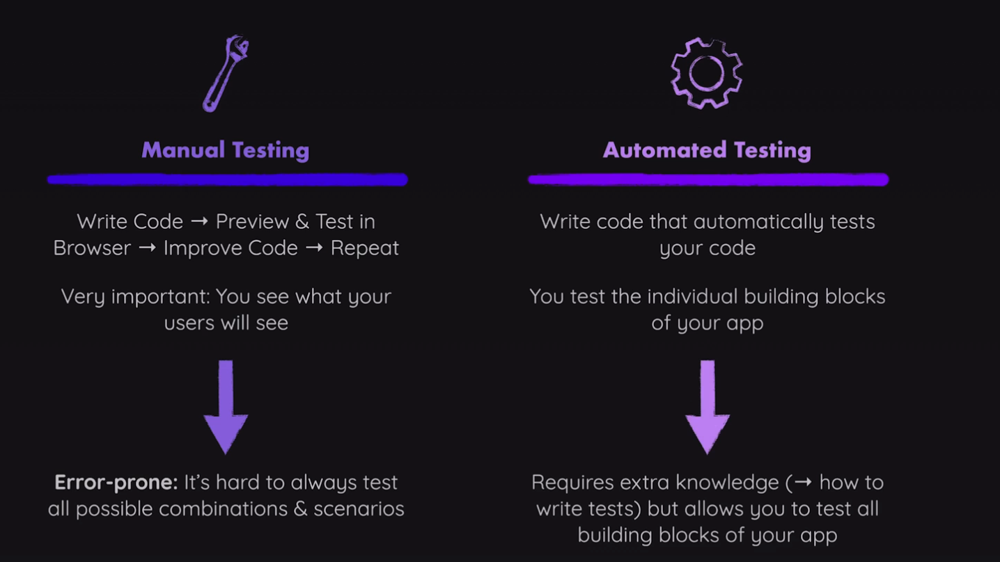
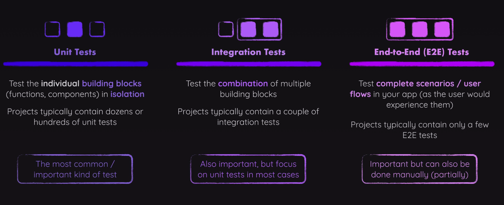
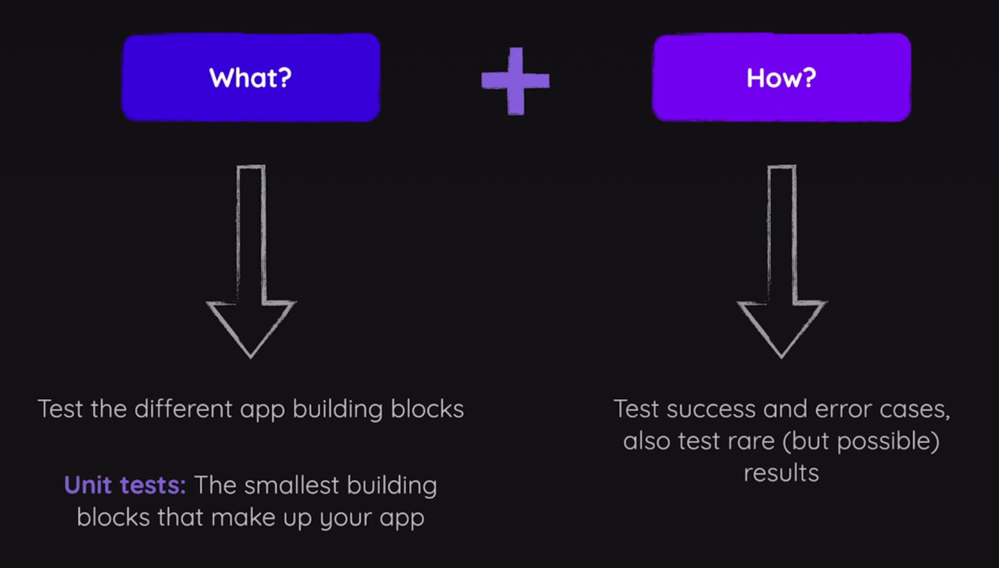
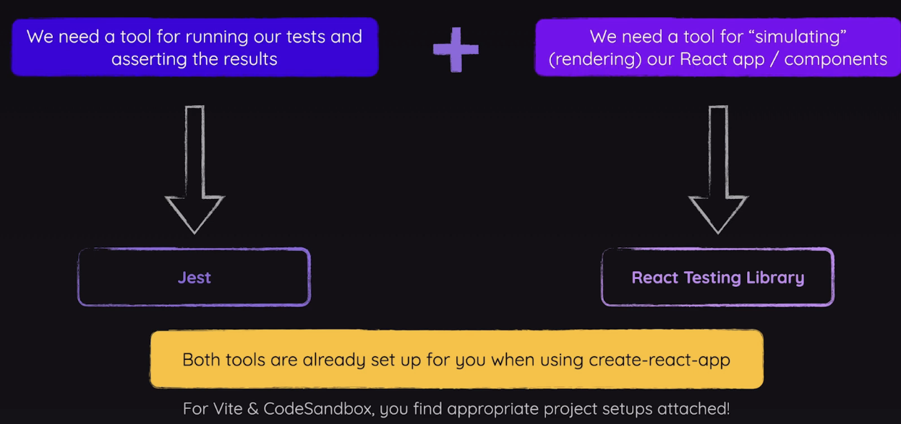

**Intro to Testing in React**

In this guide, we'll focus on automated testing. Automated testing is important because in manual testing ,you might change something that breaks something else, whereas automated tests always run all tests.



Recall the three main types of tests. **Unit tests** which aim to test the smallest possible build blocks (functions, or components in react typically) in isolation. Next, **Integration tests** which test multiple units together. Finally, **End-to-End (E2E)** tests, which test entire workflows or scenarios in the app. You'll notice though in React apps, it can sometimes be tough to differentiate unit tests from integration tests, because there are lots of component dependencies so it's often too hard to tests components completely in isolation.



When starting testing, we should answer two main questions early on: what to test, and how to test it. On the topic of what to test, with respect to the most common kind, unit tests, we want lots of tests on the smallest building blocks of our app. This is so that if they fail the reason why is clear, compared to  larger tests which can be difficult to debug for why they failed. On the topic of how to test, we want to test both the happy path, and error cases, and always should test rare but possible scenarios that you don't expect to happen, even if unlikely, to cover all bases. This is what makes a robust test.



To get set up with testing a React app, you need two main tools. First, you need a test runner and assertion library, which is typically [**Jest**](https://jestjs.io/docs/getting-started). Jest handles running your test files, provides built-in functions to check that your code behaves as expected, and gives you utilities for mocking, and more. This means you can write tests that check whether components render the right output or call the correct functions under certain conditions.

Second, you need a way to actually render your React components in a test environment, which is where [**React Testing Library (RTL)**](https://testing-library.com/docs/react-testing-library/intro/) comes in. React Testing Library lets you render components into a simulated browser DOM so you can interact with them and make assertions about their behaviour, just like a user would. It encourages you to write tests based on how users interact with your UI, rather than digging into component internals. 

Together, Jest and React Testing Library make it straightforward to write fast, reliable tests that check your app’s UI and logic in a realistic way.



One more extra note, on how backend testing and frontend testing philosophy differs. In backend testing, the focus is usually on isolating logic within individual classes or functions, so dependencies like databases or external services are often mocked to control test conditions and ensure reliability. In frontend testing, especially with tools like RTL, the emphasis is on testing what the user sees and does, so tests avoid mocking internal state and instead should strive to simulate real user interactions as closely as possibly, ensuring the UI behaves correctly from an end-user perspective.

**A First Example**

Heres a first look at a test for a simple one app, with just one component `App.jsx`. Notice the convention for naming test files; The test file for `Component.jsx` is `Component.test.jsx`.

`App.jsx`
```jsx
import logo from './logo.svg';  
import './App.css';  
  
function App() {  
  return (  
    <div className="App">  
      <header className="App-header">  
          
        <p> Edit <code>src/App.js</code> and save to reload. </p>  
        <a className="App-link"  
          href="https://reactjs.org"  
          target="_blank"  
          rel="noopener noreferrer"  
        >  
          Learn React  
        </a>  
      </header>    
    </div> 
  );  
}  
  
export default App;
```

`App.test.jsx`:
```jsx
import { render, screen } from '@testing-library/react';  
import App from './App';  
  
test('renders learn react link', () => {  
  render(<App />);  
  const linkElement = screen.getByText(/learn react/i);  
  expect(linkElement).toBeInTheDocument();  
});
```

The `test` function wraps the whole test, and takes in a string for a description of the test, and an anonymous function that contains the code that the test will run. This function is globally available with Jest installed, and thus *does not need to be imported*. To break it down, we are simulating rendering the `App` with RTL's `render`, getting an element "from the screen" (i.e. the testing env's virtual DOM) based on the text rendered inside it, with the `i` meaning case-insensitivity, using RTL's `screen`, and asserting that the selected element is indeed in the virtual DOM using Jest's globally available `expect`. If the element is found, the test will pass, otherwise it will fail; we can run tests with `npm test` command. In Create React App, you can run your tests with the `npm test` command right away because Jest is already set up for you by default, and Jest knows to run all those files ending in `.test.js` or `.test.jsx` (in Vite theres some extra setup).

If we run the test in `App.test.jsx`, it will pass because the text 'Learn React' is present in `App.js` within the `<a>` (link) element. If we change that text to 'Learn More' while `npm test` is still running, Jest is actually still watching for changes by default, and so it will automatically rerun the test conveniently, and in this case will fail since the text no longer matches. The output of the test will look something like:

```jsx
Unable to find an element with the text: /learn react/i. This could be because the text is broken up by multiple elements. In this case, you can provide a function for your text matcher to make your matcher more flexible.

<body>
  <div>
    <div
      class="App"
    >
      <header
        class="App-header"
      >
        
        <p>
          Edit 
          <code>
            src/App.js
          </code>
           and save to reload.
        </p>
        <a
          class="App-link"
          href="https://reactjs.org"
          rel="noopener noreferrer"
          target="_blank"
        >
          Learn More
        </a>
      </header>
    </div>
  </div>
</body>

... more stuff, including a stack trace
```

**Writing our first Test**

We can follow a framework called "The Three A's" to write good tests.
- Arrange: Set up the test data/mocks, test conditions, and test environment (virtual test env DOM)
- Act: Run the logic that should be tested (e.g. simulate a button click, if that's what you wanted to test)
- Assert: Compare execution results with expected results

Lets say we have a new component in our app, `Greeting`. In a quick rewrite of `App`, we'll just render `Greeting`.

`App.jsx`
```jsx
import './App.css';  
import Greeting from './components/Greeting';  
  
function App() {  
  return (  
    <div className="App">  
      <Greeting/>    
    </div> 
  );  
}  
  
export default App;
```

`Greeting.jsx`
```jsx
const Greeting = () => {  
    return (  
        <div>  
            <h2>Hello World!</h2>  
            <p>It's good to see you!</p>  
        </div>    
    )  
}  
  
export default Greeting;
```

Now, to test that `Greeting` renders the correct text, even though we could technically run that same `render` within `App.test.jsx` and it would work, we would prefer based on unit testing philosophy that the test is as close to the real thing as possible, so we'll write a new test component `Greeting.test.jsx` using the 3A approach. In this case, Arrange corresponds to rendering `Greeting` with `render`, Act to nothing (since this example is very simple), and Assert using `screen` and `expect`.

`Greeting.test.jsx`:
```jsx
import {render, screen} from "@testing-library/react";  
import Greeting from "./Greeting";  
  
import Greeting from "./Greeting";  
  
describe('My Greeting Component', () => {  
    test('"renders hello world"', () => {  
        // Arrange  
        render(<Greeting/>);  
  
        // Act  
        // ... nothing, since this first example is so simple  
        
        // Assert        
        const helloWorld = screen.getByText("Hello World", {exact: false});  
        expect(helloWorld).toBeInTheDocument();  
    })  
})
```

In this first example, using `screen.getByText` , there is a second argument for options. Here, were using `{exact: false}`, which overrides the default behaviour of `exact : true`  in order to allow for case-insensitivity (in a different way from the `i` seen before) and for substrings. In this case wee need this option for our test to pass, since, while subtle, `Greeting` is rendering "Hello World!", for which "Hello World" is a substring.

We also wrapped the whole thing in another global Jest function, `describe`. This function is for separating tests into **test suites**. In this small app, its not really needed but just for example, but in a real app with hundreds or thousands of tests, we can run test suites independent which can be helpful. It takes in a description for the test suite, and an anonymous function that contains a number of tests. Also notice by convention how the `describe` component forms a sort of sentence with the `test` description, which is by convention for readability. Here is reads, "My Greeting Component renders Hello World", which is very clear for what its trying to do. Note that You can also nest `describe` functions within either other if needed.

**Testing User Interactions and State**

Lets first upgrade our greeting component with some state tied to text rendering that changes with a button click, so that we can test that out.

`Greeting.jsx`
```jsx
import {useState} from "react";  
  
const Greeting = () => {  
    const [changedText, setChangedText] = useState(false);  
  
    const changeTextHandler = () => {  
        setChangedText(!changedText);  
    }  
  
    return (  
        <div>  
            <h2>Hello World!</h2>  
            {!changedText ? <p>It's good to see you!</p> : <p>Changed!</p>}  
            <button onClick={changeTextHandler}>Change Text!</button>  
        </div>    
    )  
}  
  
export default Greeting;
```

Now, with the conditional rendering with the button, we want to test *ALL POSSIBLE SCENARIOS* to really ensure the app works. So lets test both if the original "It's good to see you!" text is rendered when the state `changedText = false`, *AND* if the text "Changed!" renders when `changedText = true`. But remember that we are mimicking user interactions with testing philosophy, which means testing the button press, and *NOT* the state itself directly *EVER*! So we can import `userEvent` which is also part of RTL to help us do that: 

`Greeting.test.jsx`
```jsx
import {render, screen} from "@testing-library/react";  
import userEvent from "@testing-library/user-event";  
import Greeting from "./Greeting";  
  
describe("Greeting Component", () => {  
    test('renders "hello world"', () => {  
        render(<Greeting/>);  
        const helloWorld = screen.getByText("Hello World", {exact: false});  
        expect(helloWorld).toBeInTheDocument();  
    })  
  
    test('renders "good to see you" if the button was NOT clicked', () => {  
        render(<Greeting />);  
        const goodToSeeYou = screen.getByText("good to see you", 
          {exact: false});  
        expect(goodToSeeYou).toBeInTheDocument();  
    })  
  
    test('does not render "good to see you" if the button was clicked', () => {  
        render(<Greeting />);  
        const button = screen.getByRole("button")  
        userEvent.click(button);  
  
        // Note the use of queryByText, since findByText would error       
        const goodToSeeYou = screen.queryByText("good to see you", 
          {exact: false})  
        expect(goodToSeeYou).not.toBeInTheDocument();  
    })  
  
    test('renders "changed" if the button was clicked', () => {  
        // Arrange  
        render(<Greeting />);  
  
        // Act  
        const button = screen.getByRole("button")  
        userEvent.click(button);  
  
        // Assert  
        const changed = screen.getByText("Changed!")  
        expect(changed).toBeInTheDocument();  
    })  
})
```

Querying for in HTML elements with the `screen` API, there are different types of functions available. `getXXX` functions will throw and error if they can't find what they are looking for. `queryXXX` functions will not throw an error, and will instead return `null`. `findXXX`** functions will return a `Promise`, so it's enough if the element *eventually* renders on the screen and should be used for elements that appear asynchronously. It's important to understand this because your `expect` assertion will assert exactly what the outcome is, and using the wrong `screen` API method may create unexpected results and fail tests that should pass or vice versa. An example of this could be chaining `.not` onto our `expect` assertion to check if something is not expected `toBeInTheDocument`, which will not properly work with `getXXX`since that will error, but will with `queryXXX`. This is why we use `queryByText` in the test 'does not render "good to see you" if the button was clicked', since the lack of presence of the text would error with `getByText`. Otherwise the test to always fail regardless of if that text actually renders, which would make that test useless. 

>\*\*[Here](https://medium.com/@AbbasPlusPlus/react-testing-library-understanding-act-and-when-to-use-it-301bd06fd1bc) you can find more about the underlying `act` function that `findXXX` functions use under the hood.

We also used `getByRole("button")`, which works because “button” is an **accessibility role** defined by HTML and the [ARIA Standard](https://www.w3.org/TR/html-aria/#docconformance). These roles are *NOT* 1:1 mappings with HTML element names, look at the documentation in the [ARIA Standard](https://www.w3.org/TR/html-aria/#docconformance) to find these mappings. This matches how assistive technologies (like screen readers) identify elements ensuring your tests are more aligned with how users interact with the app, since users don't know about HTML elements.

> Note: When using `@testing-library/user-event` v14 and above, you should `await` user interactions like `userEvent.click()`. This change was made to better mimic real browser behaviour in that events are not instant. The result of this change is that your test function would then be declared as `async`.

**Testing Asynchronous Code**

Consider the following asynchronous components, which fetches some JSON data to display:

`Async.jsx`:
```jsx
import { useEffect, useState } from 'react';  
  
const Async = () => {  
    const [posts, setPosts] = useState([]);  
  
    useEffect(() => {  
        fetch('https://jsonplaceholder.typicode.com/posts')  
            .then((response) => response.json())  
            .then((data) => {  
                setPosts(data);  
            });  
    }, []);  
  
    return (  
        <div>  
            <ul>
              {posts.map((post) => (  
                  <li key={post.id}>{post.title}</li>  
              ))}  
            </ul>  
        </div>    
    );  
};  
  
export default Async;
```

Now, we want to test if our `posts` where successfully rendered if the fetch request was successful. We can do this by checking if the list items render, since those only render if the fetch is successful.

Using previous intuition, we might try to incorrect write

`Async.test.jsx (Incorrectly Assuming Synchronicity)`:
```jsx
import Async from "./Async";  
import {render, screen} from "@testing-library/react";  
  
describe('Async Component', () => {  
    test('renders posts if request succeeds', () => {  
        render(<Async/>);  
        const listItemElements = screen.getAllByRole("listitem");  
        expect(listItemElements).not.toHaveLength(0);  
    })  
})
```


The issue is that `getAllByRole`, as would `queryAllByRole`, will instantly look for matching elements. This will instead need look a little different than before, since `fetch` is asynchronous, by using `await` with `findAllByRole` in an `async` test. It also helps understand our `Async` component's rendering lifecycle here with `useEffect`; first it will render with no `posts`, then once the `fetch` data comes in, it will re-render with that data, which is why the list items are not there instantly (there are two renders at play).

`Async.test.jsx (Corrected)`:
```jsx
import Async from "./Async";  
import {render, screen} from "@testing-library/react";  
  
describe('Async Component', () => {  
    test('renders posts if the request succeeds', async () => {  
        render(<Async/>);  
        const listItemElements = await screen.findAllByRole("listitem");  
        expect(listItemElements).not.toHaveLength(0);  
    })  
})

```

Now, this test will pass. But... this test is still not ideal... (see ***working with mocks***, next section)

**Working With Mocks**

So our previous async test will pass, but it's not ideal because we are still relying on the data from the `fetch` API coming in from `render`. This is not a good idea. Firstly, if the server your fetching from is your own backend server, you'll be spamming that server which can overload it at scale with hundreds or thousands of tests, or what if that server is down? Secondly, if your doing something more complex that is not a `GET` request but something like a `POST` request, then the test will start messing with data in the DB/server which is not good. 

We do not want our tests to depend on anything on the server-side, so we should instead **mock** those server-side interactions. The two options for this are a system where we don't actually send a request in the first place and mock the fetching of the data, or we can mock the server dependency with a sort of fake server. Now, the second option makes sense if the server is our own server, so we'll go with the first option, because we *do not want to test systems/code which we have not written*.

`Async.test.jsx (Fully Corrected!)`
```jsx
import Async from "./Async";  
import {render, screen} from "@testing-library/react";  
  
describe('Async Component', () => {  
    test('renders posts if request succeeds', async () => {  
        window.fetch = jest.fn().mockResolvedValue({  
            json: async () => [{ id: 'p1', title: 'First post' }],  
        });  
        render(<Async/>)  
        const listItemElements = await screen.findAllByRole("listitem")  
        expect(listItemElements).not.toHaveLength(0);  
    })  
})
```

Now what are we actually doing here? We are *overriding* `fetch` from the global `window` object, with a Jest blank mock function `jest.fn()`. Then, we call `mockResolvedValue` which sets up that the mock returns a promise that resolves to an object. Next, we follow the expected format of the resulting data, which is another object with a single property `json` (you can understand this by knowing the `fetch` API's expected return format, by looking at the `Async.jsx` code), which itself also returns a promise with some data and so we call an `async` function to get that data. Now, we have fully mocked the `fetch` API and its resulting data, which matches the real expected return format in both shape and asynchronicity without an external server dependency.